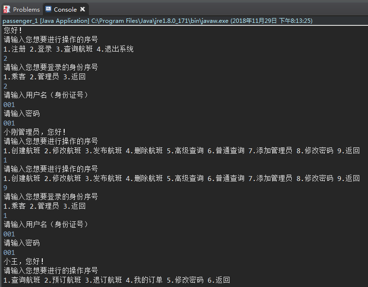
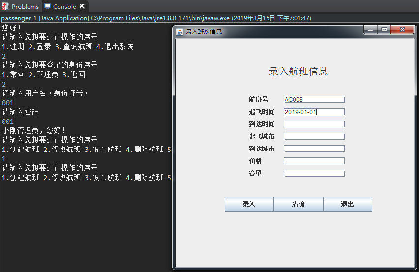
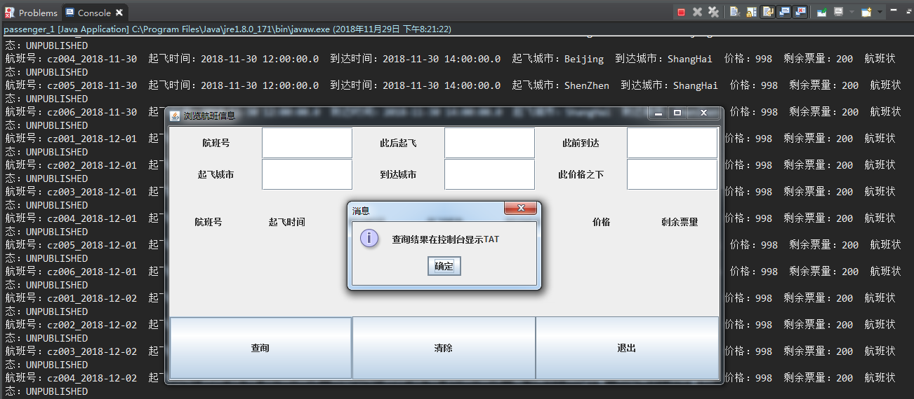

# Flight Ticket Reservation
此项目为2016年大一时初次接触Java语言

### 项目需求
创建一个具有完整售票流程的机票预订系统，具有创建、查询、预订、更新等功能。  
显示选项信息、获取用户输入等操作，在命令行完成即可。  
**加分项:** GUI，数据库  

### 项目成果
初步学习应用java语言，了解Java基础的GUI工具包`Swing`，接触`mysql`数据库<br>

 ***运行截图如下***   
1. 主要步骤： <br><br>
  
2. 创建航班GUI界面：<br><br>
  
3. 查询航班GUI界面：<br><br>

<br>

### 使用方法
`clone`到本地后直接`Import workspace`
```
git clone https://github.com/YaohuiHan/Flight_ticket_reservation
```
**Note:** 需要提前配置数据库，迁移数据等，建表语句如下：
```
create database Project;
```
以及迁移数据库：  
```
mysql -u root -p Project < "Project.sql"  
```

### 运行环境
Mysql: `Server version: 5.7.18-log MySQL Community Server (GPL)`  
Java: `jdk1.8.0_121`
